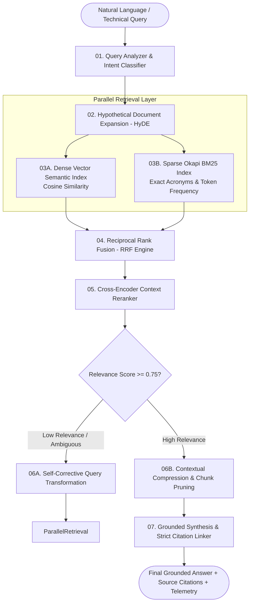

<div align="center">

# ⚡ Enterprise High-Throughput Hybrid RAG Engine

[](https://fastapi.tiangolo.com)
[](https://streamlit.io/)
[](https://www.docker.com/)
[](tests/)

<p align="center">
  <b>Production-grade Hybrid RAG engine combining Dense Embeddings, Okapi BM25 Keyword Search, Reciprocal Rank Fusion (RRF), Cross-Encoder Reranking, and Self-Corrective CRAG.</b>
</p>

[✨ Live Interactive UI](http://localhost:8501) • [📚 API Documentation (Swagger)](http://localhost:8000/docs) • [💼 Author Profile](https://github.com/saikrishnayemineni)

</div>

---

## 📌 Architecture & Mathematical Formulation



---

## 🔬 Mathematical Formulations

### 1. Okapi BM25 Formula:
$$Score(D, Q) = \sum_{i=1}^{N} IDF(q_i) \cdot rac{f(q_i, D) \cdot (k_1 + 1)}{f(q_i, D) + k_1 \cdot \left(1 - b + b \cdot rac{|D|}{	ext{avgdl}}
ight)}$$

### 2. Reciprocal Rank Fusion (RRF):
$$RRF(d) = \sum_{m \in \{Dense, Sparse\}} rac{w_m}{k + 	ext{rank}_m(d)} \quad (k=60)$$

---

## 🚀 Quick Start

### 1. Clone & Install
```bash
git clone https://github.com/saikrishnayemineni/production-hybrid-rag.git
cd production-hybrid-rag
python -m venv venv
.\venv\Scripts\activate
pip install -r requirements.txt
```

### 2. Run Instant Benchmark
```bash
python validate_rag.py
```

### 3. Launch Interactive UI
```bash
streamlit run src/ui/app.py
```
Open: `http://localhost:8501`

### 4. Launch FastAPI Server
```bash
uvicorn src.api.main:app --reload --port 8000
```
Open: `http://localhost:8000/docs`

---

## 👨‍💻 Author

**Sai Krishna Yemineni** — *Production AI/ML Engineer*  
- Portfolio: [sai-krishna-portfolio-drab.vercel.app](https://sai-krishna-portfolio-drab.vercel.app)  
- LinkedIn: [linkedin.com/in/sai-krishna-yemineni](https://www.linkedin.com/in/sai-krishna-yemineni)  
- GitHub: [@saikrishnayemineni](https://github.com/saikrishnayemineni)
